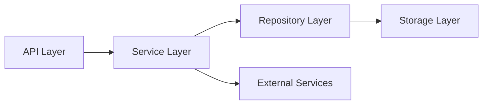

# System Patterns

## Architecture Overview

### Container Architecture (Conceptual)
```mermaid
graph TD
    User[User via Chat Client] --> ChatService[Chat Service API (e.g., Slack)]
    ChatService --> API[API Gateway / Load Balancer (e.g., Traefik)]
    API --> DocGenService[DocGen Service (FastAPI App)]
    DocGenService --> DB[(Database - PostgreSQL)]
    DocGenService --> FileStore[File Storage (Local/S3)]
```

1.  **Components**
    *   **Chat Service API:** External interface for the chat platform (e.g., Slack API) where users interact.
    *   **API Gateway / Load Balancer:** (Optional but recommended for production) Manages incoming API requests, routing, SSL termination (e.g., Traefik).
    *   **DocGen Service:** The main application container handling business logic, template management, variable extraction, and document generation.
    *   **Database:** Stores template metadata, variable lists, potentially user information (e.g., PostgreSQL).
    *   **File Storage:** Stores the actual template files (e.g., local volume mount, cloud storage like S3).

2.  **Communication Flow**
    *   User sends command via Chat Client.
    *   Chat Service sends event/request to DocGen Service (likely via webhook handled by the API Gateway).
    *   DocGen Service processes the request (listing templates, initiating generation).
    *   DocGen Service interacts with Database for metadata.
    *   DocGen Service interacts with File Storage for template files.
    *   DocGen Service interacts back with Chat Service API to prompt user for variables or deliver results.

## Design Patterns

### Container Patterns
*(These remain generally applicable for containerized deployment)*
1.  **Sidecar Pattern:** For logging, monitoring, etc., alongside the main DocGen Service container.
2.  **Ambassador Pattern:** If using a service mesh or complex proxy setup.
3.  **Multi-stage Build:** Optimize Docker image for development, testing, and production.

### Application Patterns
1.  **Repository Pattern:** Abstract data access for templates (metadata in DB, files in File Storage).
2.  **Service Layer Pattern:** Encapsulate core business logic (template operations, document generation, chat interaction logic).
3.  **Strategy Pattern:** Potentially used for handling different template file types (DOCX, MD, TXT) or different variable replacement logic.
4.  **Unit of Work Pattern:** Manage database transactions, especially when updating metadata and potentially storing generated document info.

## Component Relationships

### Service Dependencies


1. Layer Responsibilities
   - API: Request handling
   - Service: Business logic (Template management, Doc generation, Chat interaction)
   - Repository: Data access (DB metadata, File Storage access)
   - Storage: Persistence (PostgreSQL, File System/S3)
   - External: Chat Service API (e.g., Slack)

2. Cross-cutting Concerns
   - Logging
   - Authentication
   - Error handling
   - Monitoring

## Deployment Patterns

### Container Orchestration
1. Service Deployment
   - Single replica
   - Rolling updates
   - Health checks
   - Auto-recovery

2. Network Configuration
   - Overlay network
   - Service discovery
   - Load balancing
   - SSL termination

3. State Management
   - Stateless design preferred for DocGen Service (state managed in DB/File Store).
   - External state store (Database, File Storage).
   - Temporary storage for intermediate generation steps if needed.

### High Availability
1. Fault Tolerance
   - Health monitoring
   - Auto-restart
   - Rollback capability
   - Error recovery

2. Scalability
   - Horizontal scaling
   - Load distribution
   - Resource optimization
   - Connection pooling

## Security Patterns

### Access Control
1. Authentication
   - Potentially via Chat Service (validating Slack user/token).
   - API Keys for direct API access (if applicable).
   - User authentication layer (Future Phase).

2. Authorization
   - Resource permissions
   - Action restrictions
   - User isolation
   - Data segregation

### Data Protection
1. Transport Security
   - TLS between Chat Service <-> API Gateway <-> DocGen Service.
   - Secure headers.
   - Certificate management.

2. Storage Security
   - Secure configuration for File Storage (e.g., S3 bucket policies).
   - Database access controls.
   - Consider encryption at rest for sensitive templates/data (if required).

## Monitoring Patterns

### Health Monitoring
1. Service Health
   - Endpoint checks
   - Resource monitoring
   - Dependency status
   - Error tracking

2. System Health
   - Container metrics
   - Network status
   - Storage usage
   - Performance metrics

### Logging Pattern
1. Log Management
   - Structured logging
   - Log rotation
   - Aggregation
   - Analysis

2. Audit Trail
   - User actions
   - System events
   - Error records
   - Performance data

## Error Handling

### Failure Patterns
1. Circuit Breaker
   - Service protection
   - Fallback behavior
   - Recovery strategy
   - State management

2. Retry Pattern
   - Exponential backoff
   - Retry limits
   - Failure tracking
   - Success criteria

### Recovery Patterns
1. Graceful Degradation
   - Partial functionality
   - Feature toggles
   - Fallback options
   - User notification

2. Self Healing
   - Auto-restart
   - State recovery
   - Data consistency
   - Service restoration

## Performance Patterns

### Optimization
1. Caching
   - Response cache
   - Data cache
   - Template cache
   - Query cache

2. Resource Management
   - Connection pooling
   - Thread management
   - Memory optimization
   - I/O efficiency

### Scaling
1. Horizontal Scaling
   - Service replication
   - Load distribution
   - State management
   - Consistency

2. Resource Allocation
   - CPU limits
   - Memory constraints
   - Storage quotas
   - Network bandwidth
