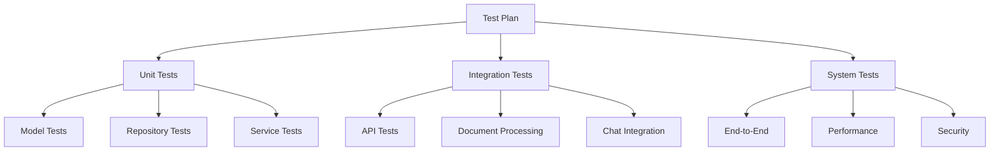
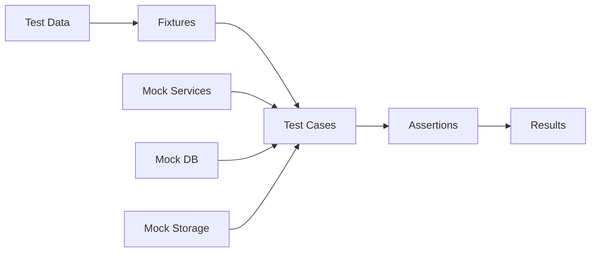
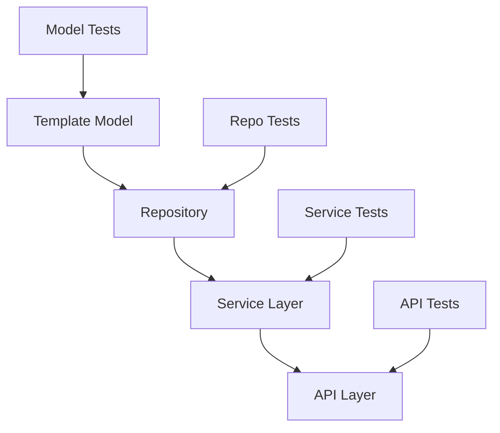

# System Patterns

## Architecture Overview

### Core Components
1. Template Management System
   - Template storage and retrieval
   - Metadata management
   - Variable extraction
   - File handling

2. Document Processing System
   - Template rendering
   - Variable replacement
   - Format preservation
   - Error handling

3. Chat Integration
   - Context-aware processing
   - Intelligent variable extraction
   - Vector store integration
   - Natural language understanding

## Design Patterns

### Repository Pattern
- Used for template management
- Abstracts storage details
- Provides CRUD operations
- Manages metadata persistence

```python
class TemplateRepository:
    def __init__(self, templates_dir: str):
        self.templates_dir = templates_dir
        self.metadata_file = os.path.join(templates_dir, "templates_metadata.json")
```

### Service Layer Pattern
- Handles business logic
- Separates concerns
- Provides high-level operations
- Manages dependencies

```python
class TemplateProcessor:
    def process_template(self, template: Template, data: Dict[str, Any]) -> DocxTemplate:
        # Template processing logic
```

### Model-View Pattern
- Clear data models
- Validation rules
- Type safety
- Serialization handling

```python
class Template(BaseModel):
    id: str
    name: str
    description: Optional[str]
    file_path: str
    variables: Dict[str, str]
    created_at: datetime
    updated_at: datetime
```

### Factory Pattern
- Template creation
- Document generation
- Response formatting
- Error handling

## Data Flow Patterns

### Template Upload Flow
1. File validation
2. Storage management
3. Variable extraction
4. Metadata creation

### Template Processing Flow
1. Template loading
2. Variable validation
3. Data mapping
4. Document generation

### Chat Processing Flow
1. Context retrieval
2. Template selection
3. Variable extraction
4. Document generation

## Error Handling Patterns

### Validation Errors
- Input validation
- File type checking
- Variable validation
- Data format validation

### Processing Errors
- Template loading errors
- Variable replacement errors
- File system errors
- Format preservation errors

### System Errors
- Storage errors
- Processing timeouts
- Resource constraints
- External service errors

## Security Patterns

### Input Validation
- File type validation
- Size limits
- Content validation
- Path traversal prevention

### Access Control
- File access control
- Operation authorization
- Resource isolation
- Error masking

### Data Protection
- Secure storage
- Metadata protection
- Variable sanitization
- Output validation

## Integration Patterns

### File System Integration
- Secure file handling
- Directory management
- Path resolution
- Resource cleanup

### Chat Integration
- Context management
- Response generation
- Template selection
- Variable extraction

### Vector Store Integration
- Semantic search
- Context retrieval
- Relevance scoring
- Result filtering

## Performance Patterns

### Caching
- Template caching
- Metadata caching
- Result caching
- Context caching

### Resource Management
- File handle management
- Memory usage optimization
- Processing queues
- Batch operations

### Error Recovery
- Graceful degradation
- Retry mechanisms
- Fallback options
- State recovery

## Testing Patterns

### Unit Testing
- Model validation
- Business logic
- Error handling
- Edge cases

### Integration Testing
- API endpoints
- File operations
- Template processing
- Chat integration

### Security Testing
- Input validation
- Access control
- Error handling
- Resource protection

## Deployment Patterns

### Configuration Management
- Environment variables
- Feature flags
- Resource limits
- Error thresholds

### Monitoring
- Error logging
- Performance metrics
- Usage statistics
- Health checks

### Scaling
- Load distribution
- Resource allocation
- Cache management
- Storage scaling

## Documentation Patterns

### Code Documentation
- Function documentation
- Class documentation
- Parameter documentation
- Error documentation

### API Documentation
- Endpoint documentation
- Request/response formats
- Error responses
- Authentication requirements

### User Documentation
- Usage guidelines
- Error handling
- Best practices
- Examples

## Future Considerations

### Planned Patterns
1. Authentication and Authorization
   - User management
   - Role-based access
   - Permission system
   - Session handling

2. Audit Logging
   - Operation logging
   - Access logging
   - Error logging
   - Security events

3. Performance Optimization
   - Template caching
   - Batch processing
   - Resource pooling
   - Load balancing

4. Advanced Features
   - Template versioning
   - Collaborative editing
   - Template sharing
   - Advanced formatting

## Architecture Patterns

### 1. Testing Architecture


### 2. Test Data Flow


### 3. Component Testing


## Design Patterns

### 1. Test Fixtures
- Centralized test data management
- Reusable mock objects
- Consistent test environment
- Automated cleanup

### 2. Repository Pattern
- Abstracted data access
- Centralized CRUD operations
- Consistent error handling
- Transaction management

### 3. Service Layer
- Business logic encapsulation
- Cross-cutting concerns
- Error handling
- Validation logic

## Implementation Patterns

### 1. Test Implementation
```python
# Test Case Structure
def test_feature():
    # Arrange
    test_data = setup_test_data()
    
    # Act
    result = perform_operation(test_data)
    
    # Assert
    assert_expected_outcome(result)
```

### 2. Mock Objects
```python
# Mock Service Pattern
class MockService:
    def __init__(self):
        self.data = {}
    
    async def operation(self, input):
        # Simulate operation
        return expected_result
```

### 3. Test Utilities
```python
# Common Test Utilities
def create_test_template():
    return Template(
        name="Test",
        variables={"key": "value"}
    )

def setup_test_environment():
    # Configure test environment
    pass
```

## Testing Patterns

### 1. Unit Testing
- Isolated component testing
- Mock dependencies
- Comprehensive assertions
- Edge case coverage

### 2. Integration Testing
- Component interaction testing
- Real service integration
- Error propagation
- State management

### 3. System Testing
- End-to-end workflows
- Performance benchmarks
- Security validation
- Load testing

## Error Handling

### 1. Test Errors
- Expected errors in tests
- Error case coverage
- Validation testing
- Recovery scenarios

### 2. Mock Error Handling
```python
class MockErrorService:
    def operation(self):
        raise ExpectedError("Test error")
```

### 3. Assertion Patterns
```python
def test_error_handling():
    with pytest.raises(ExpectedError):
        service.operation()
```

## Security Patterns

### 1. Security Testing
- Input validation
- Authentication testing
- Authorization checks
- Security headers

### 2. Test Data Security
- Secure test data
- Sanitized inputs
- Protected credentials
- Cleanup procedures

## Performance Patterns

### 1. Performance Testing
- Response time testing
- Load testing
- Resource monitoring
- Bottleneck identification

### 2. Test Optimization
- Efficient test execution
- Parallel testing
- Resource cleanup
- Cache management

## Documentation Patterns

### 1. Test Documentation
- Clear test descriptions
- Expected outcomes
- Setup requirements
- Edge cases

### 2. Coverage Documentation
- Test coverage reports
- Missing coverage areas
- Critical path testing
- Risk assessment

## Monitoring Patterns

### 1. Test Monitoring
- Test execution metrics
- Coverage tracking
- Performance metrics
- Error tracking

### 2. Quality Metrics
- Code coverage
- Test pass rate
- Performance benchmarks
- Security scores
