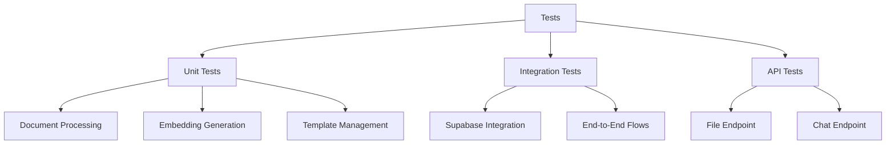

# System Patterns

## Architecture Overview

### Container Architecture (Conceptual)
```mermaid
graph TD
    User[User via Web Interface] --> API[API Gateway / Load Balancer (e.g., Traefik)]
    API --> DocService[Document Processing Service (FastAPI App)]
    DocService --> SupabaseDB[(Supabase Vector Database)]
    DocService --> FileStore[Template Storage (Local Volume)]
```

1.  **Components**
    *   **Web Interface:** External interface where users upload documents and interact with the system. **THIS IS NOT PART OF OUR PROJECT, THIS BE DEVELOPED SEPARATELY**
    *   **API Gateway / Load Balancer:** Manages incoming API requests, routing, SSL termination (e.g., Traefik).
    *   **Document Processing Service:** The main application container handling document processing, template analysis, and RAG integration.
    *   **Supabase Vector Database:** Stores document chunks, embeddings, and metadata for RAG operations.
    *   **Template Storage:** Stores the document templates (in the /templates directory).

2.  **Communication Flow**
    *   User uploads document or sends chat request via Web Interface.
    *   API Gateway routes request to the Document Processing Service.
    *   For document uploads (/file endpoint):
        *   Document is processed, chunked, and embedded.
        *   Chunks and embeddings are stored in Supabase.
    *   For chat interactions (/chat endpoint):
        *   User query is processed, embeddings retrieved from Supabase.
        *   Document Processing Service analyzes content and suggests templates.
        *   Response is returned to the user.

## Design Patterns

### Container Patterns
*(These remain generally applicable for containerized deployment)*
1.  **Sidecar Pattern:** For logging, monitoring, etc., alongside the main Document Processing Service container.
2.  **Ambassador Pattern:** If using a service mesh or complex proxy setup.
3.  **Multi-stage Build:** Optimize Docker image for development, testing, and production.

### Application Patterns
1.  **Repository Pattern:** Abstract data access for documents and templates.
2.  **Service Layer Pattern:** Encapsulate core business logic (document processing, embedding generation, template analysis).
3.  **Strategy Pattern:** Potentially used for handling different document file types and template suggestions.
4.  **Unit of Work Pattern:** Manage database transactions, especially when storing document chunks and embeddings.
5.  **Test-Driven Development Pattern:** Write tests before implementation to ensure requirements are met.
6.  **Fixture Pattern:** Reuse test fixtures across different test cases.
7.  **Mock Pattern:** Isolate components for testing by mocking dependencies.

## Component Relationships

### Service Dependencies


1. Layer Responsibilities
   - API: Request handling (/file and /chat endpoints)
   - Service: Business logic (Document processing, RAG, Template analysis)
   - Repository: Data access (Supabase, Template files)
   - Storage: Persistence (Supabase Vector DB, File System)
   - External: Potential external services like authentication

2. Cross-cutting Concerns
   - Logging
   - Authentication
   - Error handling
   - Monitoring

## Testing Patterns

### Test Organization


1. **Test Categorization**
   - Unit tests for isolated components
   - Integration tests for component interactions
   - API tests for endpoint functionality
   - Fixtures for test data reuse

2. **Test Data Management**
   - Sample documents in multiple formats
   - Mock responses for external services
   - Standardized test vectors for embeddings
   - Shared fixtures across test categories

3. **Mocking Strategy**
   - Mock Supabase client for vector operations
   - Mock embedding generation for deterministic results
   - Simulate file uploads for API testing
   - Provide predictable responses for external dependencies

4. **Continuous Integration**
   - GitHub Actions workflow for automated testing
   - Test coverage reporting
   - Pull request validation through tests
   - Pre-merge test verification

### Test Coverage Goals
1. **Core Functionality**
   - Document processing: 90%+
   - API endpoints: 90%+
   - Supabase integration: 80%+
   - Template management: 80%+

2. **Error Handling**
   - Invalid file types
   - Supabase connection issues
   - Embedding generation failures
   - Missing or corrupted documents

3. **Edge Cases**
   - Large documents
   - Complex document structures
   - Rate limiting scenarios
   - Unusual input queries

## Deployment Patterns

### Container Orchestration
1. Service Deployment
   - Single replica deployment on Docker Swarm on VPS
   - Rolling updates with health checks
   - Auto-recovery
   - Resource constraints

2. Network Configuration
   - Overlay network
   - Service discovery
   - Load balancing
   - SSL termination

3. State Management
   - Stateless design for Document Processing Service
   - External state store (Supabase Vector DB)
   - Template files stored in a volume mount

### High Availability
1. Fault Tolerance
   - Health monitoring
   - Auto-restart
   - Rollback capability
   - Error recovery

2. Scalability
   - Horizontal scaling potential
   - Load distribution
   - Resource optimization
   - Connection pooling

## Security Patterns

### Access Control
1. Authentication
   - API Keys for direct API access (if applicable)
   - User authentication layer (Future Phase)

2. Authorization
   - Resource permissions
   - Action restrictions
   - User isolation
   - Data segregation

### Data Protection
1. Transport Security
   - TLS between Web Interface <-> API Gateway <-> Document Processing Service
   - Secure headers
   - Certificate management

2. Storage Security
   - Secure configuration for Supabase
   - Template storage access controls
   - Consider encryption at rest for sensitive documents (if required)

## Monitoring Patterns

### Health Monitoring
1. Service Health
   - Endpoint checks
   - Resource monitoring
   - Dependency status
   - Error tracking

2. System Health
   - Container metrics
   - Network status
   - Storage usage
   - Performance metrics

### Logging Pattern
1. Log Management
   - Structured logging
   - Log rotation
   - Aggregation
   - Analysis

2. Audit Trail
   - User actions
   - System events
   - Error records
   - Performance data

## Error Handling

### Failure Patterns
1. Circuit Breaker
   - Service protection
   - Fallback behavior
   - Recovery strategy
   - State management

2. Retry Pattern
   - Exponential backoff
   - Retry limits
   - Failure tracking
   - Success criteria

### Recovery Patterns
1. Graceful Degradation
   - Partial functionality
   - Feature toggles
   - Fallback options
   - User notification

2. Self Healing
   - Auto-restart
   - State recovery
   - Data consistency
   - Service restoration

## Performance Patterns

### Optimization
1. Caching
   - Response cache
   - Data cache
   - Template cache
   - Embedding cache

2. Resource Management
   - Connection pooling
   - Thread management
   - Memory optimization
   - I/O efficiency

### Scaling
1. Horizontal Scaling
   - Service replication
   - Load distribution
   - State management
   - Consistency

2. Resource Allocation
   - CPU limits
   - Memory constraints
   - Storage quotas
   - Network bandwidth
